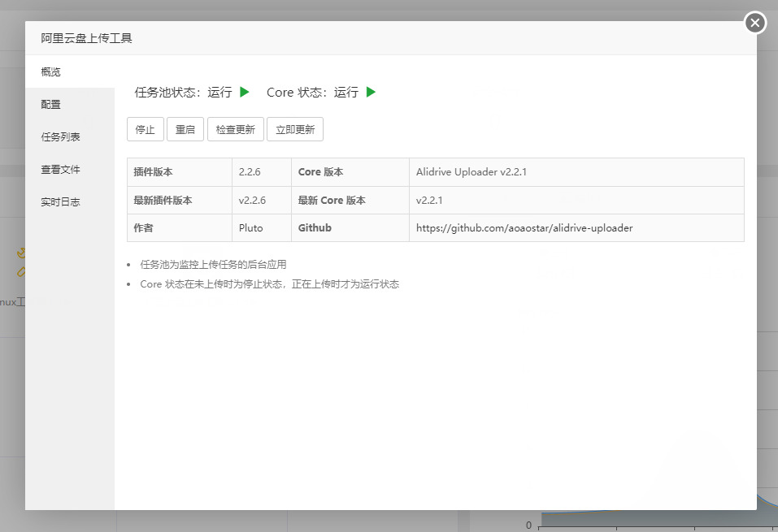
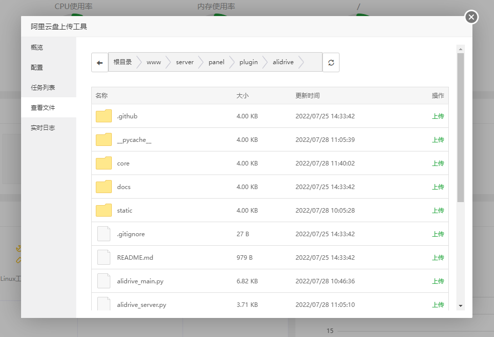
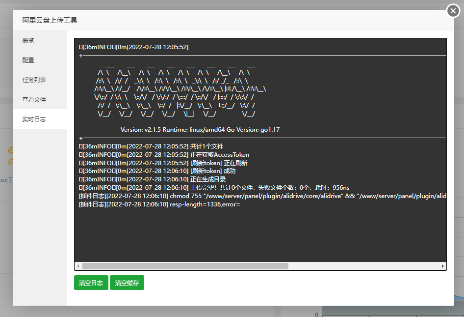

## 说明
本项目为阿里云盘上传工具的宝塔插件   
可以将服务器内的文件快速上传到阿里云盘

## 演示图



## 安装
### Centos7
```shell script
yum install -y wget && wget -O install.sh https://raw.githubusercontent.com/aoaostar/alidrive-uploader-for-baota/v2/install.sh && bash install.sh install
```
### Debian
```shell script
wget -O install.sh https://raw.githubusercontent.com/aoaostar/alidrive-uploader-for-baota/v2/install.sh && bash install.sh install
```
## 更新
```
wget -O install.sh https://raw.githubusercontent.com/aoaostar/alidrive-uploader-for-baota/v2/install.sh && bash install.sh update
```
## 配置账号信息


* 控制台快速获取代码
```javascript
var data = JSON.parse(localStorage.getItem('token'));
console.log(`refresh_token  =>  ${data.refresh_token}
default_drive_id  =>  ${data.default_drive_id}
`);
```